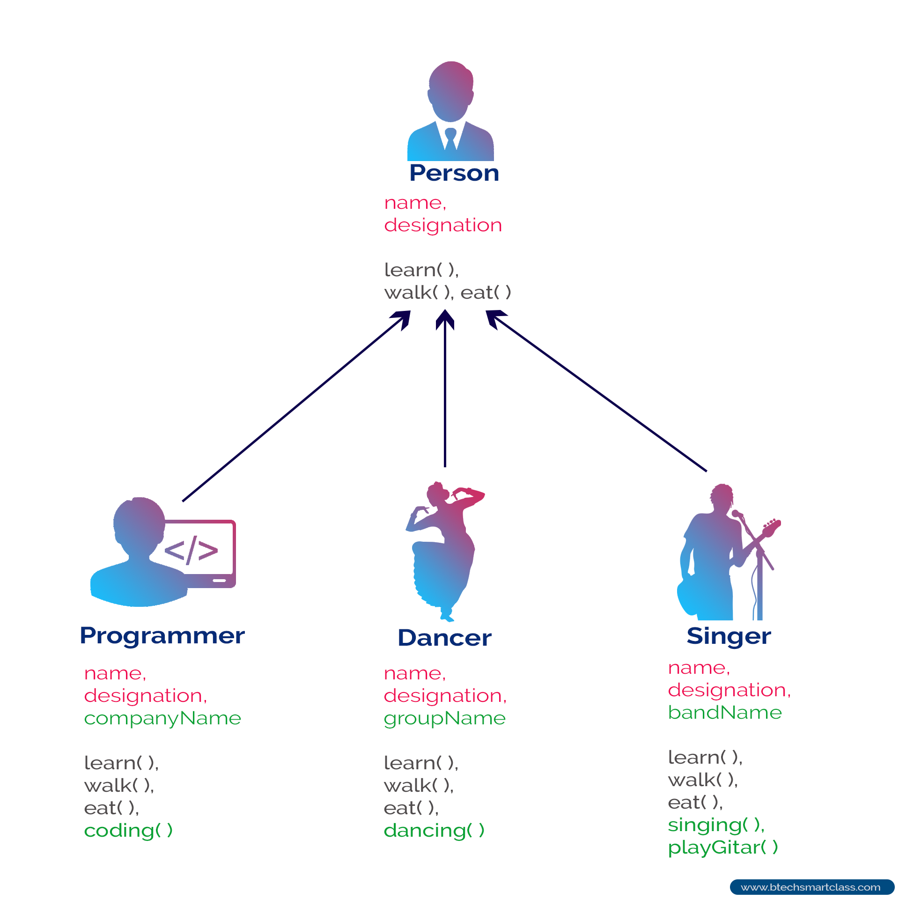

# Object Oriented Programming 
## Overview of datatype 
- Data type is a classification that specifies which type of value a variable can hold and what operations can be performed on it.

- Types of data type (based on the number of value can includes in a variable / based on the storage way in the memory / based on the type of memore):
	- Single value data type / value data type / slack memory
		- primitive data type
			- int
			- float
			- char
			- boolean
		- non-primitive data type
			- string
			- array
			- object
	- Multiple value data type / collection(reference) data type / heap memory
		- collection data type
			- list
			- set
			- map

## Overview of memory
Stack: In stack items, things get on the top of each-other, means gonna be faster and more efficient to be processed!...

So there is always an index to point the specific item, also processing gonna be faster, there is relationship between the items as well!...

Heap: No order, processing gonna be slower and values are messed up together with no specific order or index... there are random and there is no relationship between them... so execution and usage time could be vary...

 

## Overview of OOP

### Why OOP?
- We want to build a data type to be able to store multiple values with different data types in a single variable, and also we want to be able to perform operations on that data type.
- We want to organize our code in a way that makes it easier to understand, maintain, and reuse.
- We want to model real-world entities and their interactions in our code.
- We want to encapsulate data and behavior together, so that we can create more complex systems with less code duplication.

###   What is OOP?
A way of writing programs by organizing code into “objects.” These objects represent real-world things (like a car, student, or bank account) and contain data (attributes) and actions (methods).

### Features of OOP:


- 1. Encapsulation
	– Hiding the details inside the object and showing only what is needed.
	- Example:
	
- 2. Abstraction		
	– Focusing on essential features and ignoring unnecessary details.
	-Example:
	
- 3. Inheritance
    – Creating a new class using existing classes to reuse code.
	- Types:
	
	- Example:
	
- 4. Polymorphism
   – Same function name but works differently for different objects.
   -Example:
	

## Create Class 
### How to Create a Class and Object


### Fields and methods


## Setters Vs Getters
- Getters:

A getter is a method (or accessor) that returns the value of a private field in a class.
They allow other parts of the code to read the value of a private field without directly accessing it.
In C#, a getter is defined using the get keyword within a property. 

- Setters:

A setter is a method (or accessor) that modifies the value of a private field in a class.
They provide a controlled way to update the value of a private field, preventing direct modification from outside the class.
In C#, a setter is defined using the set keyword within a property. It also has access to a special keyword value which represents the value being assigned. 

- Properties:

Properties in C# combine both getter and setter methods into a single construct.
They provide a cleaner and more elegant syntax for accessing and modifying private fields compared to manually writing separate getter and setter methods.
Properties allow you to encapsulate the access to a field, potentially adding logic within the getter or setter. 

```
public class Person
{
    private string name;

    public string Name
    {
        get { return name; }
        set { name = value; }
    }

    private int age;

    public int Age
    {
        get { return age; }
        set
        {
            if (value >= 0)
            {
                age = value;
            }
            else
            {
                // Handle invalid age input (e.g., throw an exception, set to a default value)
                age = 0; // Setting a default value
            }
        }
    }
}

public class Example
{
    public static void Main(string[] args)
    {
        Person person = new Person();
        person.Name = "John Doe";
        person.Age = 30;

        Console.WriteLine($"Name: {person.Name}, Age: {person.Age}"); // Output: Name: John Doe, Age: 30

        person.Age = -5; // Trying to set an invalid age
        Console.WriteLine($"Age after invalid set: {person.Age}"); // Output: Age after invalid set: 0
    }
}


```
