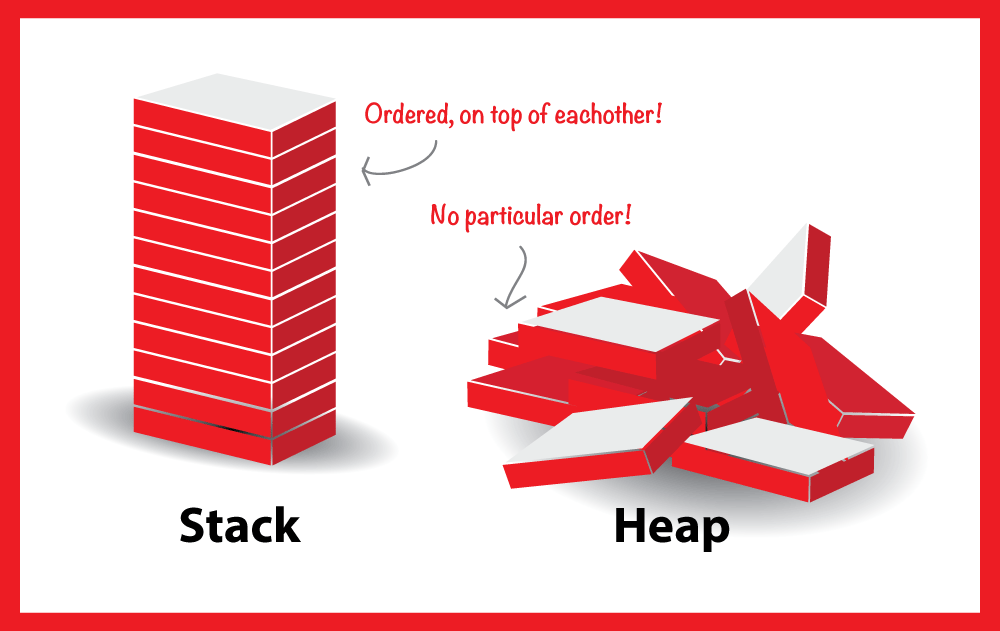

# Object Oriented Programming 
## Overview of datatype 
- Data type is a classification that specifies which type of value a variable can hold and what operations can be performed on it.

- Types of data type (based on the number of value can includes in a variable / based on the storage way in the memory / based on the type of memore):
	- Single value data type / value data type / slack memory
		- primitive data type
			- int
			- float
			- char
			- boolean
		- non-primitive data type
			- string
			- array
			- object
	- Multiple value data type / collection(reference) data type / heap memory
		- collection data type
			- list
			- set
			- map

## Overview of memory
Stack: In stack items, things get on the top of each-other, means gonna be faster and more efficient to be processed!...

So there is always an index to point the specific item, also processing gonna be faster, there is relationship between the items as well!...

Heap: No order, processing gonna be slower and values are messed up together with no specific order or index... there are random and there is no relationship between them... so execution and usage time could be vary...

 

## Overview of OOP

### Why OOP?
- We want to build a data type to be able to store multiple values with different data types in a single variable, and also we want to be able to perform operations on that data type.
- We want to organize our code in a way that makes it easier to understand, maintain, and reuse.
- We want to model real-world entities and their interactions in our code.
- We want to encapsulate data and behavior together, so that we can create more complex systems with less code duplication.

###   What is OOP?
A way of writing programs by organizing code into “objects.” These objects represent real-world things (like a car, student, or bank account) and contain data (attributes) and actions (methods).

### Features of OOP:

- 1. Encapsulation
	– Hiding the details inside the object and showing only what is needed.
	- Example:
	
- 2. Abstraction		
	– Focusing on essential features and ignoring unnecessary details.
	-Example:
	
- 3. Inheritance
    – Creating a new class using existing classes to reuse code.
	- Types:
	
	- Example:
	
- 4. Polymorphism
   – Same function name but works differently for different objects.
   -Example:
	

## Create Class 
### 
